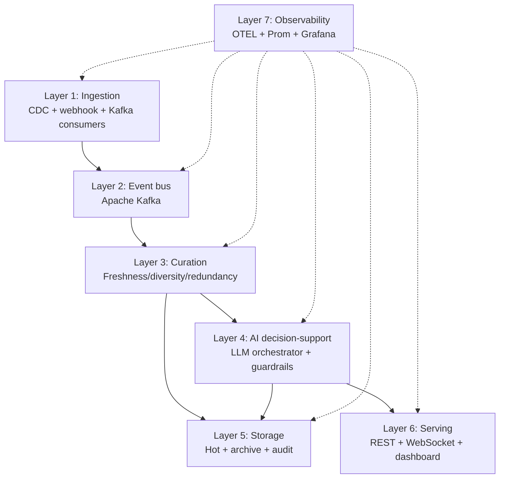
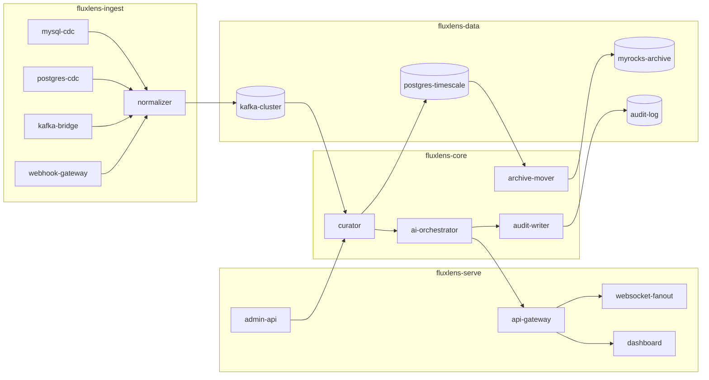
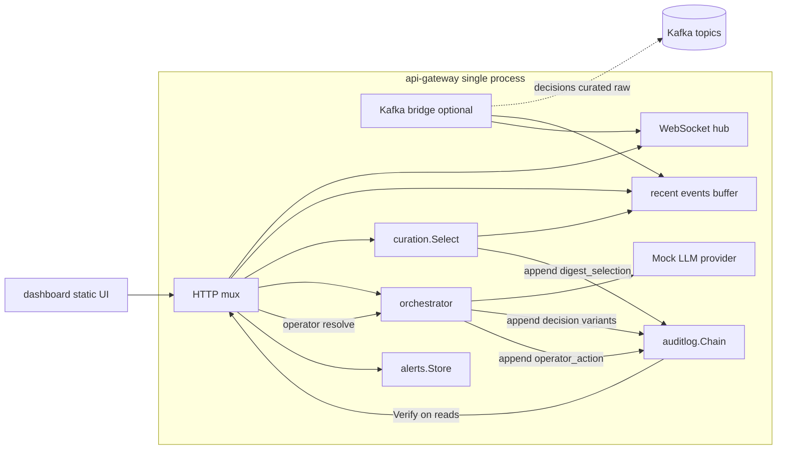
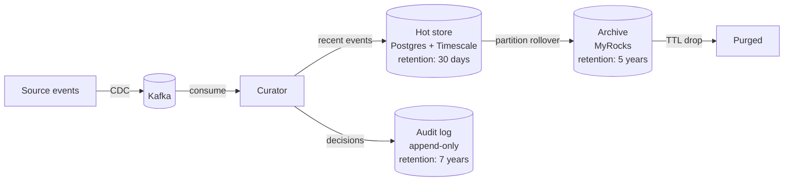
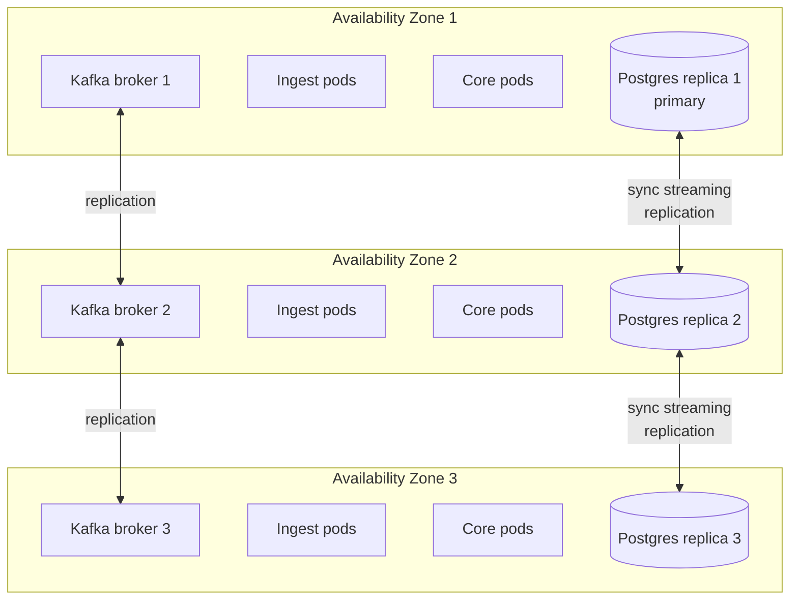
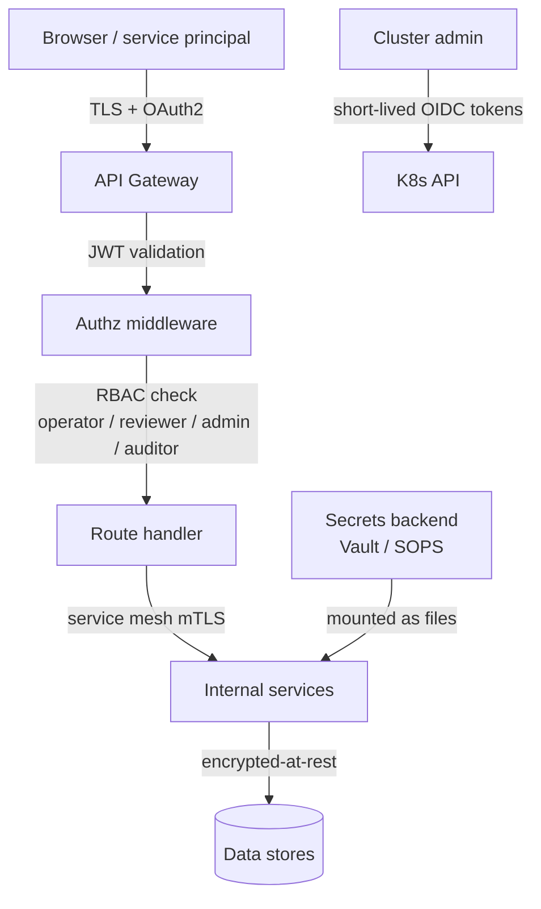
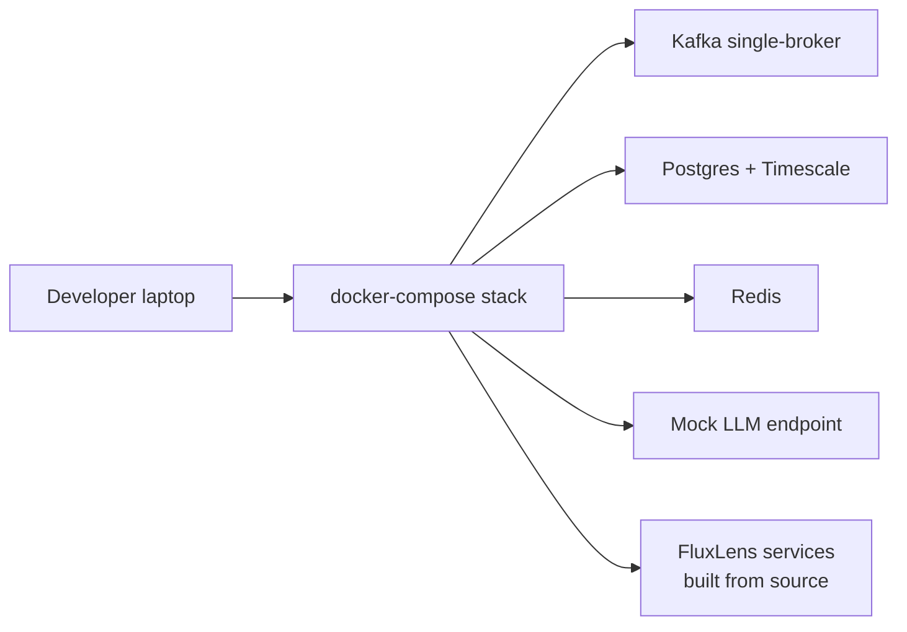
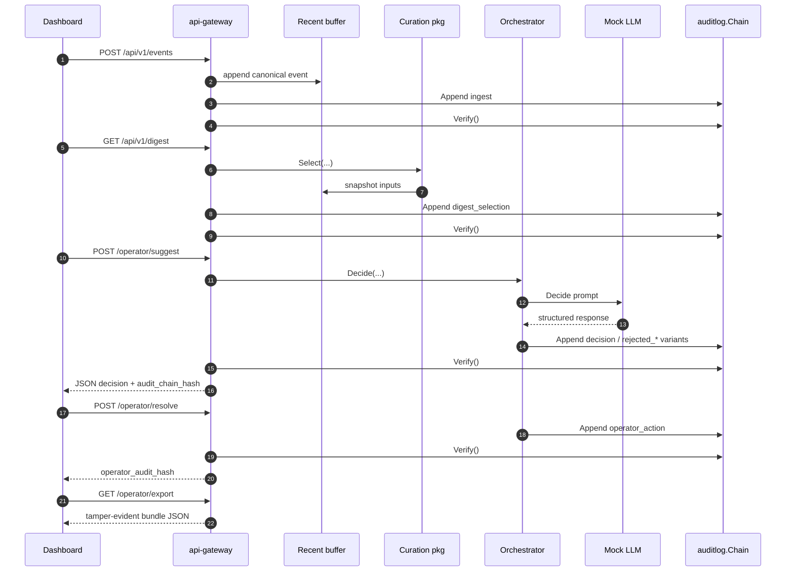
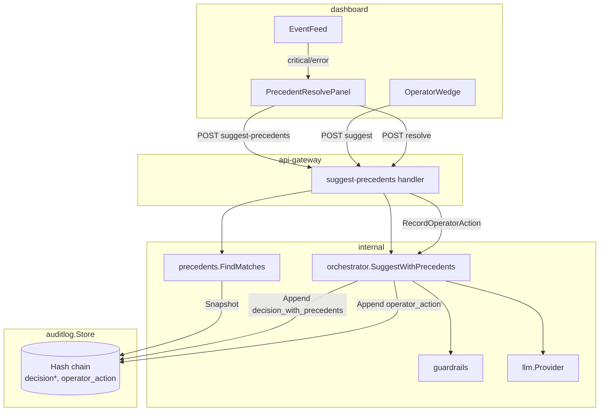
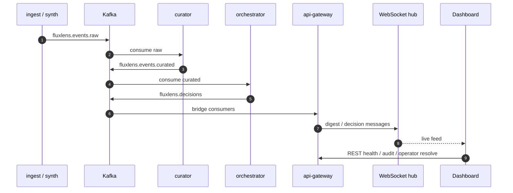

# FluxLens — Architecture

> **Author:** Sri Harsha Vanga  
> **Companion to:** [PRD.md](./PRD.md)

This document records the technical architecture and key design
decisions for FluxLens. It is intended for engineers building or
contributing to the platform.

## 1. Architectural principles

FluxLens follows five architectural principles, in order of
precedence:

1. **Source-system non-impact.** Ingestion must not meaningfully
   affect the performance of source systems. CDC-style log-following
   is preferred over polling. Backpressure must be handled at the
   FluxLens layer, never propagated to source.
2. **Verifiable human override.** No AI-suggested action is taken
   without a human-override path. The path is enforced in code, not
   in policy.
3. **Append-only auditability.** Every decision and operator action
   is recorded in a tamper-evident, hash-chained, append-only log.
4. **Pluggable provider interfaces.** LLM providers, storage
   backends, source connectors, and authentication providers are
   pluggable behind stable interfaces.
5. **Operational legibility.** OpenTelemetry tracing, Prometheus
   metrics, and structured logging are first-class concerns. The
   platform must be debuggable from the outside.

## 2. Layered architecture



## 3. Service decomposition



**Phase 1 note:** `SR2` (WebSocket fan-out) and the Kafka decisions bridge
are implemented **inside** `cmd/api-gateway` (`internal/stream`,
`internal/kafkabridge`). A separate `websocket-fanout` service remains the
target for high-scale Phase 2 deployments.

### 3.1 Phase 1 reference topology (`cmd/api-gateway`)

Production retains the decomposition above. For **depth-first demos**
(and CI), the `api-gateway` binary optionally **folds** orchestrator,
recent-events RAM buffer, digest scoring, alert buffering, and audit
verification into **one OS process** sharing a single `auditlog.Chain`.



This topology trades HA isolation for **legibility**: reviewers can
execute ingest → digest → AI suggestion → human resolution → JSON export
without Kafka or Postgres. With `-kafka`, the same process also consumes
orchestrator decisions and curated digests for the live dashboard. Horizontal
deployments MUST split writers per ADR backlog once throughput exceeds
single-node limits.

## 4. Data architecture

### 4.1 Storage tiers



### 4.2 Hot store schema (Postgres + TimescaleDB)

- `events` — hypertable partitioned by `ingested_at`, 1-day chunks
- `digests` — recent curated digests per strategy
- `decisions` — recent AI decisions (last 30 days)
- `operator_actions` — recent operator overrides/accepts

### 4.3 Archive store schema (MyRocks)

- `events_archive` — partitioned by `ingested_at`, 30-day chunks;
  partition drops for purge
- `decisions_archive` — partitioned similarly
- Compression ratio target: 2:1 vs. equivalent InnoDB (typical for
  MyRocks on similar write-heavy archive workloads)

### 4.4 Audit log architecture

The audit log is the most security-sensitive component. Properties:

```mermaid
flowchart LR
    APP[Application writer] -->|append-only RPC| WRT[Audit writer service]
    WRT -->|hash-chain<br/>compute current hash<br/>= sha256(prev_hash + payload)| LOG[(Audit log<br/>append-only)]
    WRT -->|optional| WORM[(WORM storage<br/>S3 Object Lock)]
    AUD[Auditor reads] -->|read-only| LOG
    VER[Chain verifier] -->|periodic| LOG
```

- Append-only via dedicated writer service; no application has direct
  write access to the underlying storage.
- Hash chain: each record contains `prev_hash`; current record's hash
  is `sha256(prev_hash || canonical_serialization(payload))`.
- Optional WORM (Write-Once-Read-Many) mirroring via S3 Object Lock
  in compliance mode for operators that require it.
- Periodic chain verifier process recomputes hashes and alerts on
  divergence.

**Phase 1 gateway note.** `cmd/api-gateway` keeps `auditlog.Chain` in-process,
calls `Verify()` after ingest/digest/audit/operator/export mutations, and maps
verification regressions into buffered alerts (`internal/alerts`). This makes
tampering visible during demos but **does not** satisfy separated-duties or WORM
requirements until the standalone audit-writer path is exercised.

## 5. Reliability architecture

### 5.1 Failure-domain isolation



### 5.2 Failure handling matrix

| Failure mode | Detection | Response | RPO | RTO |
|---|---|---|---|---|
| Ingest pod crash | Liveness probe | Kubernetes restart | 0 | <60s |
| Kafka broker loss | ISR shrink alert | Auto-leadership transfer | 0 | <30s |
| Postgres primary loss | Replication lag alert | Standby promotion | 0 | <120s |
| LLM provider outage | Timeout + circuit breaker | Failover to local model or degraded mode | 0 (events buffered) | <10s circuit-open |
| Network partition | OTEL trace gap | Per-AZ continued operation | 0 | depends on partition |
| Audit log write failure | Synchronous write check | Block decision pathway; alert | 0 | <5s |

## 6. Security architecture

### 6.0 Phase 1 reference auth (shipped)

The reference gateway enforces **API keys** (`Authorization: Bearer` or
`X-API-Key`) and optional **role bindings** (`FLUXLENS_API_KEY_ROLES`:
`secret:operator+admin`). Roles: `operator`, `reviewer`, `admin`, `auditor`.
WebSocket `/api/v1/stream` accepts the same keys when configured. When no
keys are set, middleware runs in local-dev mode (all roles). This is not a
substitute for enterprise OIDC; see target model below.

### 6.1 Target production auth (Phase 2+)



- **Authentication:** OAuth 2.0 / OIDC for human users; service-
  account JWTs for service-to-service.
- **Authorization:** Role-based (operator / reviewer / admin /
  auditor) with per-namespace scoping.
- **Encryption:** TLS in transit (1.3 minimum); encryption at rest
  for all data stores.
- **Secrets:** External secret backend (Vault or cloud-native KMS);
  never committed to repo.
- **Image provenance:** Sigstore / cosign signed container images;
  admission controller enforces signed-image policy.

## 7. Architecture Decision Records (ADRs)

Maintained under `/docs/adr/`. Index:

- **ADR-001:** Use CDC over polling for source-system ingestion.
- **ADR-002:** Apache Kafka as the event bus (vs. NATS, Pulsar).
- **ADR-003:** Postgres + TimescaleDB for hot store (vs. ClickHouse,
  InfluxDB).
- **ADR-004:** MyRocks for archive tier (vs. plain InnoDB, S3 Glacier).
- **ADR-005:** Append-only hash-chained audit log (vs. blockchain-
  based or signed batches).
- **ADR-006:** Human-override enforced in code, not policy.
- **ADR-007:** Pluggable LLM provider interface (vs. OpenAI-only).
- **ADR-008:** Kubernetes-native deployment; no support for non-
  containerized deployment.
- **ADR-009:** OpenTelemetry as the sole observability standard.
- **ADR-010:** Apache 2.0 license (vs. AGPL, BSL).

Each ADR follows the [Michael Nygard ADR
template](https://github.com/joelparkerhenderson/architecture-decision-record)
and is added before any non-trivial architectural change.

## 8. Technology stack rationale

| Component | Choice | Rationale |
|---|---|---|
| Ingestion services | Go | High-throughput, low-memory, mature CDC ecosystem |
| ML services | Python | Standard ML/LLM ecosystem |
| Event bus | Kafka | Production-proven at very high throughput in large operators |
| Hot store | Postgres + TimescaleDB | ACID guarantees + time-series partitioning |
| Archive store | MyRocks | LSM-tree compression for cold data |
| Audit log | Append-only on Postgres with WORM mirror | Tamper-evidence via hash chain |
| Orchestration | Kubernetes | Standard horizontal scale + failover |
| API gateway | Custom Go service behind nginx-ingress | Lightweight, OpenTelemetry-native |
| Dashboard | TypeScript + React | Modern, accessible UI |
| Observability | OpenTelemetry + Prometheus + Grafana | Vendor-neutral |
| Service mesh (optional) | Linkerd | Lighter than Istio; mTLS by default |
| Secrets | HashiCorp Vault or cloud-native KMS | Pluggable |
| CI | GitHub Actions | Standard, free for OSS |

## 9. Local development architecture



The single-machine docker-compose stack starts Kafka, Postgres, Redis,
a mock LLM endpoint, and all FluxLens services from source for
developer iteration. `make dev` brings the stack up.

### 9.1 Operator wedge sequence (reference UI path)

When hitting only `api-gateway` + static dashboard assets, the dominant
sequence reduces to synchronous REST calls—still respecting guardrails +
explicit operator acknowledgement semantics:



Buffered alerts populate via the same handlers whenever ingest severity,
digest heuristics, chain verification, AI review flags, or resolutions fire—see
PRD §9.1.

### 9.2 Precedent retrieval and operator UX wedge extension

The operator wedge (§9.1) is extended by **`POST /api/v1/operator/suggest-precedents`**
and the dashboard **Suggested actions** control on critical/error feed rows.
`internal/precedents` scans the same `auditlog.Store` the gateway and orchestrator
share (in-memory `Chain` or Postgres when `FLUXLENS_POSTGRES_DSN` is set). Matching
requires a completed past resolution: a guardrails-passing decision record plus a
linked `operator_action`. The orchestrator appends **`decision_with_precedents`** on
success; human resolution still flows through **`operator_action`** only. See
[PRD — Precedent-informed resolution](PRD.md#precedent-informed-resolution).



### 9.3 Kafka-connected dashboard path

When `api-gateway` runs with `-kafka` alongside `curator`, `orchestrator`,
and a synthetic or CDC ingest path:



The UI still uses REST for operator accept/override/annotate and audit
export; WebSocket carries incremental digest and decision visibility.

## 10. Observability architecture

Every service emits OpenTelemetry traces (W3C trace context), metrics
(Prometheus exposition format), and structured logs (JSON, line-
delimited). The OpenTelemetry Collector sidecar aggregates and
exports to operator-configured backends.

Standard dashboards (Grafana JSON committed to `/dashboards/`):

- Ingestion throughput and lag per source
- Curation engine throughput and selection-strategy mix
- AI orchestrator latency distribution and guardrails-rejection rate
- Audit log write rate and chain-verifier status
- API latency p50/p95/p99 per endpoint
- Pod and node resource utilization
