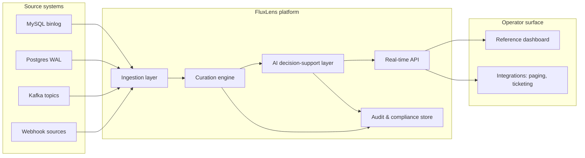
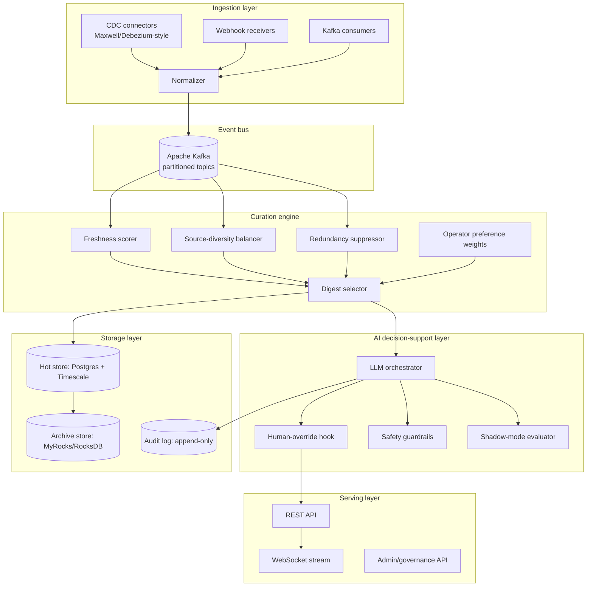
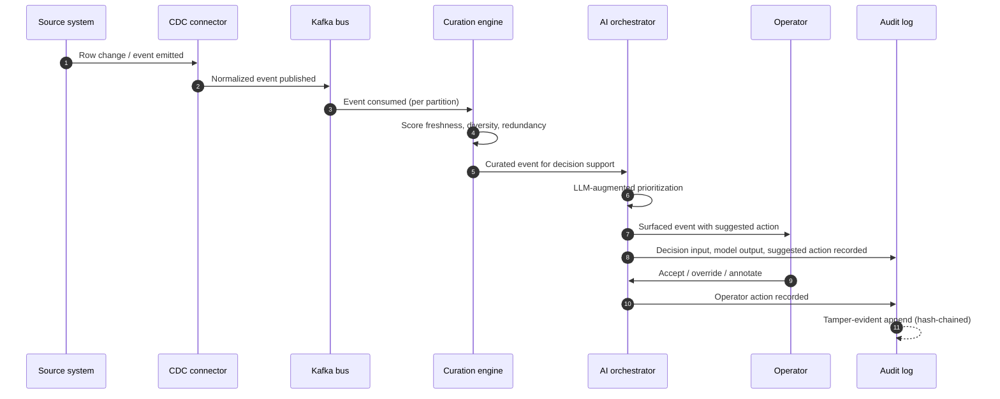
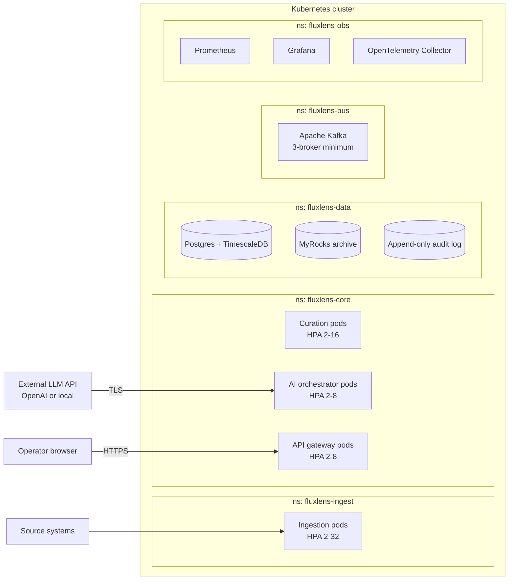
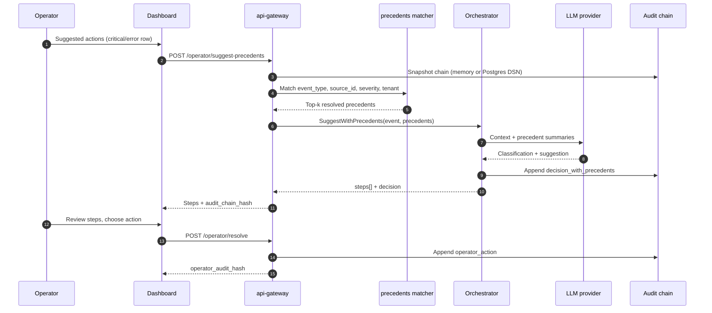
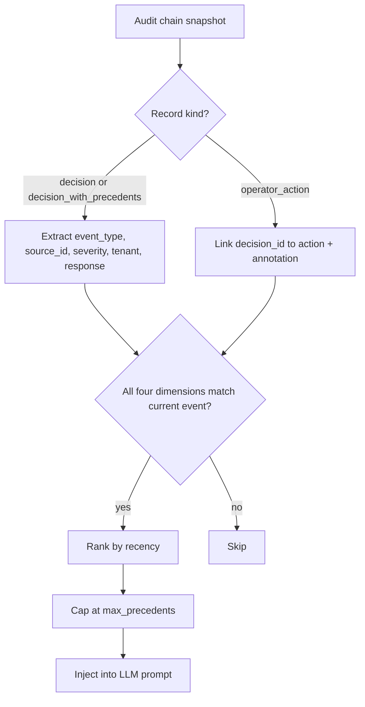
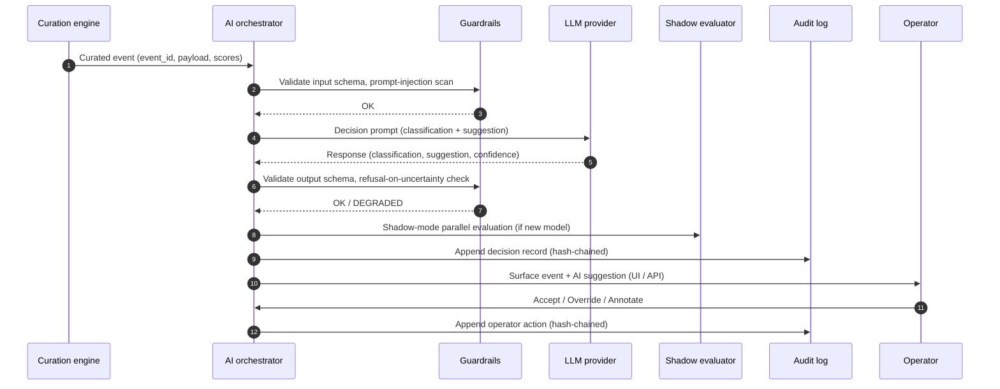

# FluxLens — Product Requirements Document

> **Author:** Sri Harsha Vanga

## 1. Executive Summary

FluxLens is an open-source platform for AI-augmented industrial event
curation and decision support. It addresses a recurring problem in
U.S.-critical industrial operations — clean-energy manufacturing,
national-scale retail and supply-chain operations, federally funded
research environments — where operators are overwhelmed by
high-velocity event streams and lack tooling that combines
hyper-scale ingestion, intelligent curation, AI-augmented decision
support, and federally compliant auditability.

FluxLens provides a single composable platform that:

1. Ingests events from distributed sources at production scale with
   zero impact on source systems, using Change Data Capture (CDC)
   patterns.
2. Curates the resulting event streams using freshness, source-
   diversity, and redundancy-aware algorithms so that operators see
   the highest-value events without alert fatigue or source
   monopolization.
3. Augments operator decision-making with LLM copilots constrained
   by hard human-override guarantees and per-decision audit trails.
4. Produces a verifiable, immutable audit trail for every decision —
   appropriate for sectors subject to federal compliance requirements.

The project bundles these operational patterns into a single open-source reference implementation. It is targeted at U.S.
operators in sectors identified by federal policy (Inflation
Reduction Act §45X, CHIPS and Science Act, CISA-designated critical
infrastructure, NIST AI Risk Management Framework) as strategically
important.

## 2. Problem Statement

### 2.1 The signal-overload problem in critical operations

Modern industrial, retail, energy, and federal research operations
generate high-velocity event streams from distributed sources. A
single clean-energy manufacturing line can emit millions of sensor,
telemetry, quality, and supply-chain events per day across thousands
of devices. A national retailer emits similar volumes from store
operations, workforce scheduling, supply-chain telemetry, and
emergency-response systems. A federally funded research environment
emits research-coordination, instrument-telemetry, and security-audit
events from distributed scientific teams.

In each environment, operators face the same composite problem:

1. **Alert fatigue.** Volumes exceed operator attention capacity.
   Important events are missed or acted on late.
2. **Source monopolization.** A small number of high-volume sources
   crowd out lower-volume but operationally critical sources.
3. **Redundancy.** Operators see the same event repeatedly through
   different paths.
4. **Unstructured AI deployment.** Where AI is used to triage events,
   it is often deployed without verifiable human-override guarantees
   or per-decision audit trails — failure modes that
   federally-significant operations cannot tolerate.

### 2.2 Why existing tooling does not solve it

- **Generic CDC platforms (Debezium, Maxwell, Kafka Connect)** solve
  ingestion at scale but do not curate the resulting streams or
  augment them with decision support.
- **Alerting platforms (PagerDuty, Opsgenie)** route events but do
  not curate by freshness/diversity/redundancy or apply AI-augmented
  prioritization.
- **AI assistants (off-the-shelf LLM copilots)** prioritize events
  but lack the verifiable human-override and audit guarantees
  required for federally compliant deployment.
- **Internal one-off solutions** built inside individual large
  operators solve the problem for one organization but are not
  reusable open-source artifacts.

FluxLens is the first open-source platform to combine all four
capabilities — hyper-scale CDC ingestion, freshness/diversity/
redundancy curation, AI-augmented decision support, and federal-
grade auditability — into a single composable reference architecture.

## 3. Target Users

FluxLens is built for engineering teams operating high-velocity
event streams in sectors where decision quality, reliability, and
auditability matter.

| User type | Example | Primary use |
|---|---|---|
| Manufacturing reliability engineer | Clean-energy battery/EV/solar manufacturing | Real-time event curation for production-line alerts |
| Supply-chain operations engineer | National retailer, distribution network | Event-stream prioritization for logistics and frontline operations |
| Federal research IT operations | DOE national laboratory | Research-coordination event surfacing with federal-grade audit |
| Site reliability engineer | Any high-throughput online operator | Cross-source event curation and AI-assisted triage |
| Compliance and audit engineer | Regulated industries | Verifiable per-decision audit trail |

## 4. Goals and Non-Goals

### 4.1 Goals (in scope)

1. Ingest events from common sources (MySQL binlog, PostgreSQL
   logical replication, Kafka topics, generic webhook) with zero
   meaningful impact on source systems.
2. Curate event streams using configurable freshness, source-
   diversity, and redundancy-aware algorithms.
3. Augment operator decisions with LLM copilots that operate under
   hard human-override and audit guarantees.
4. Produce a tamper-evident audit trail for every decision.
5. Deploy on Kubernetes with horizontal scalability.
6. Provide an operator-facing REST and WebSocket API and a reference
   web dashboard.
7. Document architectural patterns sufficient that other engineers
   can adopt or fork the patterns for their own deployments.

### 4.2 Non-Goals (out of scope)

1. Replace specialized industrial control systems (SCADA, MES, OT
   protocols). FluxLens consumes events from these systems but does
   not directly control plant equipment.
2. Replace general-purpose alerting/paging platforms. FluxLens may
   integrate with them downstream.
3. Provide pre-built domain ontologies. Operators define event
   semantics for their own domain.
4. Make autonomous high-stakes decisions without human override.
   Every decision pathway must include a human-override path.

## 5. System Architecture

### 5.1 System context diagram



### 5.2 Component architecture



### 5.3 Data flow diagram



### 5.4 Deployment architecture



## 6. Module Specifications

### 6.1 Ingestion layer

**Purpose.** Consume change events from source systems with zero
meaningful impact on source performance.

**Components.**
- **MySQL CDC connector** — based on Maxwell/Debezium-style binlog
  following with JSON change events emitted to Kafka.
  *Reference implementation:* `cmd/ingest-mysql`, `internal/cdc/mysql`.
- **Postgres CDC connector** — uses logical replication slots and
  `pgoutput` plugin to capture row-level changes.
  *Reference implementation:* `cmd/ingest-postgres`, `internal/cdc/postgres`.
- **Kafka consumer** — for environments where events are already on
  Kafka; FluxLens re-curates and re-publishes.
  *Reference implementation:* `cmd/curator`, `cmd/orchestrator`; gateway
  Kafka bridge when `-kafka` is set (see §6.5).
- **Webhook receiver** — for generic HTTP event sources.
  *Reference implementation:* `POST /api/v1/webhook` on the gateway;
  `cmd/webhook-gateway` for edge HTTP → Kafka (+ optional gateway mirror).
- **Normalizer** — translates source-specific event shapes into a
  canonical FluxLens event schema (see §10).

**Key reliability properties.**
- At-least-once delivery semantics with idempotent downstream
  consumers.
- Per-partition offset checkpointing.
- Automatic failover via consumer-group rebalancing.
- Dead-letter queue for events that fail normalization after `N`
  retries.

**Throughput target (Phase 1).** Sustained 1,000 events/sec/pod;
horizontally scalable to 32 pods.

### 6.2 Curation engine

**Purpose.** Apply freshness/diversity/redundancy-aware curation to
the ingested event stream, producing a curated digest stream for
downstream decision support.

**Algorithmic basis.** Six strategies balance freshness (recency),
source diversity, and redundancy suppression on industrial event streams.

**Six configurable selection strategies:**

1. **Latest events** — pure freshness. Returns the `k` most recent
   events regardless of source.
2. **Latest per source** — pure diversity. Returns the latest event
   per source.
3. **Hybrid latest + per-source** — combines freshness and diversity.
4. **Guaranteed-minimum source diversity** — operator specifies a
   minimum source-coverage percentage; algorithm guarantees it while
   maximizing freshness within the constraint.
5. **Guaranteed minimum with randomized eviction** — variant of (4)
   with randomized eviction policy.
6. **Preferred-source weighting** — operator-specified preferred
   sources are guaranteed representation when present.

**Redundancy suppression.** Hash-based fingerprint of the last `N`
curated events; events whose fingerprints match within the suppression
window are demoted.

**Operator preference weights.** Per-operator (or per-team) weights
on event categories, sources, severity levels.

### 6.3 AI decision-support layer

**Purpose.** Augment operator decision-making on each curated event
with LLM-generated context, classification, suggested action, and
risk assessment — under hard human-override and audit guarantees.

**Architecture properties (non-negotiable).**
- Every decision pathway has a verified human-override hook before
  any external action is taken.
- Every decision (input, model output, suggested action, confidence)
  is written to the audit log before the suggestion is surfaced.
- Shadow-mode evaluator allows new models to run in parallel with
  existing logic without affecting operator surface; predictions
  are logged but not acted on, enabling 60–90 day validation before
  production cutover.
- Safety guardrails: prompt-injection defenses, output schema
  validation, refusal-on-uncertainty.

**LLM integrations supported (Phase 1).**
- OpenAI API (GPT-class models).
- Local model serving (Ollama, vLLM) for environments where
  data-egress is restricted.

**Pluggable model interface.** Operators can substitute their own
models behind a standard interface; FluxLens does not lock to a
specific LLM provider.

### 6.4 Audit and compliance store

**Purpose.** Provide a tamper-evident, append-only record of every
event ingested, every curation decision made, every AI suggestion
generated, and every operator action taken.

**Properties.**
- **Append-only.** No update or delete on audit records.
- **Hash-chained.** Each record contains the hash of the prior record;
  any tampering breaks the chain and is detectable.
- **Schema-validated.** Audit records conform to a versioned schema.
- **Retention-policy aware.** Per-record TTL with partition-level
  drop for efficient retention purge common on LSM-style archive tiers.

**Compliance alignment.**
- Authentication and access control patterns aligned with federal IT
  compliance models (FedRAMP-style separation of duties).
- Audit-log export supports SIEM ingestion (Splunk, Elastic).

### 6.5 Real-time API

**Purpose.** Expose curated event streams, AI suggestions, and
operator actions to dashboards and integrations.

**Endpoints (Phase 1).**
- `GET  /api/v1/health` — health and component status
- `GET  /api/v1/digest/:strategy/:diversity/:n` — request a curated
  digest using one of the six selection strategies
- `WS   /api/v1/stream` — real-time push of curated events
- `POST /api/v1/decisions/:id/override` — operator override
- `GET  /api/v1/audit/:from/:to` — audit log export
- `GET  /api/v1/config/sources` — list configured sources
- `POST /api/v1/config/sources` — register a new source
- `POST /api/v1/config/reload` — hot-reload configuration

**Implemented reference slice (`cmd/api-gateway`, Phase 1 demo).**
The shipping gateway exposes an end-to-end **operator wedge** on a
single in-memory audit chain: ingest canonical events, compute a
curated digest, obtain a mock-LLM orchestrator suggestion with
guardrails, record an explicit operator accept/override/annotate
action, and export the chain as JSON. Operator-visible **alerts**
(ingest severity, digest-quality heuristics, chain-verification
transitions, review-required AI outcomes) buffer in-process for the
dashboard; they are **not** persisted or forwarded to paging systems
in this build.

Concrete REST handlers today:

- `GET /api/v1/health` — liveness plus audit-chain verification summary and buffered alert count
- `POST /api/v1/events` — accept one validated canonical event into the recent-events buffer with `ingest` audit append
- `GET /api/v1/digest` — query parameters `strategy`, `diversity`, `k`; returns curated selection; appends **`digest_selection`** audit record (distinct from orchestrator AI records)
- `GET /api/v1/audit` — snapshot hash chain with verifier status
- `GET /api/v1/alerts` / `DELETE /api/v1/alerts` — list or clear buffered operator alerts
- `POST /api/v1/operator/suggest` — JSON body `{ event_id, instruction? }`; runs `internal/orchestrator` on the shared chain using a bundled manufacturing-line supervisor prompt when `instruction` is omitted
- `POST /api/v1/operator/suggest-precedents` — JSON body `{ event_id, instruction?, max_precedents? }`; retrieves similar past `operator_action` + `decision` rows from the audit chain, calls the LLM with precedent context, returns `steps[]` (optional `cited_precedent_hash`) plus a `decision` audited as **`decision_with_precedents`**
- `POST /api/v1/operator/resolve` — JSON body `{ event_id, decision_audit_hash, operator_id, action, annotation }`; values of `action` are `accept`, `override`, or `annotate`; appends **`operator_action`**
- `GET /api/v1/operator/export` — JSON bundle for offline evidence review (records + verification metadata)
- `WS /api/v1/stream` — WebSocket push of `event`, `digest`, and `decision` envelopes (see `internal/stream`)
- `POST /api/v1/webhook` — ingest webhook-shaped events into the gateway buffer (canonical `source_type: webhook`)
- `GET /api/v1/decisions` — recent orchestrator decisions buffered from Kafka when the gateway bridge is enabled
- `GET /api/openapi.yaml` — OpenAPI 3.1 spec; `GET /metrics` — Prometheus exposition

**Kafka bridge (optional, `cmd/api-gateway -kafka`):** consumes
`fluxlens.decisions`, `fluxlens.events.curated`, and `fluxlens.events.raw`
(default topic names) to feed the dashboard live feed and in-memory buffers
without replacing the wedge REST handlers.

**Authorization (Phase 1 reference):** API-key authentication
(`FLUXLENS_API_KEYS`) plus role bindings (`FLUXLENS_API_KEY_ROLES`, format
`key:operator+admin`). Operator routes require `operator`, `reviewer`, or
`admin`; audit export requires `auditor` or `admin`. Full OAuth2/OIDC remains
Phase 2 (ROADMAP M2.8).

**Still Phase 2 / not in this slice:** OAuth2/OIDC browser login, durable
alert storage, external paging webhooks, `POST /api/v1/config/sources`,
path-style digest URLs from the aspirational list above, unified audit chain
across standalone `cmd/orchestrator` and gateway (orchestrator still uses its
own in-process chain when run separately).

### 6.6 Operator dashboard

**Purpose.** Reference web UI for operators consuming the FluxLens
event stream.

**Capabilities (Phase 1).**
- Live curated event feed with strategy selector (REST polling; **WebSocket**
  `/api/v1/stream` when connected, including digest updates from the Kafka bridge)
- **Pipeline decisions panel:** shows orchestrator output from `fluxlens.decisions`
  when the gateway runs with `-kafka` and `cmd/orchestrator` is in the loop
- **Precedent-informed resolution:** on **critical** and **error** feed rows, **Suggested actions** opens a panel that calls `POST /operator/suggest-precedents`, shows ranked steps (with optional precedent citations), then links to accept / override / annotate (human-only; no autonomous moves)
- **Operator wedge strip:** choose digest row → mock AI suggestion → submit audited accept / override / annotate → download audit bundle
- Buffered alerts panel with severity cues (demo persistence only)
- AI suggestion panel per event (legacy wording; wedge consolidates flow)
- One-click override / accept / annotate
- Filter by source, severity, time window
- Audit log viewer (read-only)
- Operator preference editor

**Stack.** TypeScript + React; deployed as a static asset behind the
API gateway.

#### Precedent-informed resolution

Operators resolving **critical** or **error** events can request
**Suggested actions** from the event feed. The gateway scans the
tamper-evident audit chain for prior `decision` / `decision_with_precedents`
records that share `event_type`, `source_id`, `severity`, and tenant,
joined to a recorded `operator_action`. Top-k precedents enrich the LLM
prompt; the response is surfaced as ordered `steps[]` with optional
`cited_precedent_hash`. The operator must still **accept**, **override**,
or **annotate** via `POST /operator/resolve` — the system never executes
operational moves autonomously.





## 7. Curation Algorithms

Formal restatement of the freshness / diversity / redundancy tradeoff served by §6.2:

Let \( S = \{s_1, s_2, \ldots, s_n\} \) be the set of registered
event sources. Let \( E_i = \{e_{i,1}, e_{i,2}, \ldots\} \) be the
event stream from source \( s_i \), ordered by timestamp. The
curation engine produces a digest \( D \) of size \( k \) optimizing:

\[ D^* = \arg\max_{D} \, \lambda \cdot \text{freshness}(D) + \mu \cdot \text{diversity}(D) - \gamma \cdot \text{redundancy}(D) \]

where:

- \( \text{freshness}(D) = \frac{1}{k} \sum_{e \in D} \left( \max(\text{age}) - \text{age}(e) \right) \)
- \( \text{diversity}(D) = \frac{|\text{unique sources}(D)|}{|S|} \)
- \( \text{redundancy}(D) = \frac{|D \cap \text{recent digests}|}{|D|} \)

The six selection strategies in §6.2 represent different points on
the \( \lambda \), \( \mu \), \( \gamma \) trade-off surface, with
the guaranteed-minimum-diversity variants providing operator-tunable
constraints rather than pure objective optimization.

## 8. AI Integration Architecture (Sequence)



## 9. Compliance and Audit Model

FluxLens is designed to support deployment in operational environments
subject to federal compliance requirements, including but not limited
to:

- **NIST AI Risk Management Framework (NIST AI 100-1)** — the
  human-override, auditability, and schema-validation requirements in
  §6.3 are designed to operationalize NIST AI RMF trustworthiness
  characteristics.
- **NIST SP 800-53** — control families AC (Access Control), AU
  (Audit and Accountability), and SI (System and Information
  Integrity) are addressed by the audit log, role-based access, and
  schema-validation features.
- **SOC 2 Type II** — auditability and access-control requirements.
- **HIPAA / state-equivalent data-handling rules** — addressed via
  encrypted-at-rest storage, role-based access, and configurable PII
  redaction in the audit log.

FluxLens does not provide a compliance certification by itself;
operators remain responsible for end-to-end compliance of their
deployment. FluxLens provides the architectural primitives that make
compliant deployment achievable.

### 9.1 Operator alerting (Phase 1 demo adjunct)

Buffered **operator alerts** complement—but do not replace—the
tamper-evident audit log. Demo rules emit structured notifications when:

- Canonical ingest severity is **warn** or higher (`ingest.severity_warn_or_above`).
- Digest quality metrics cross heuristic thresholds (`digest.low_freshness`, `digest.low_diversity`, `digest.sparse_selection`).
- Gateway verification observes an audit-chain transition from valid to broken (`platform.audit_chain_invalid`).
- AI suggestions require explicit human review (`operator.review_required`).
- An operator resolution is recorded (`operator.resolution_recorded`).

Alerts apply short **dedupe windows** per rule (and per `event_id`
when present) so periodic dashboard polling does not amplify noise.
Production deployments SHALL persist alerts, attach routing policies per
tenant, and integrate with paging or ticketing systems (Phase 2+).

## 10. Data Models

### 10.1 Canonical event schema

```json
{
  "event_id": "ulid-uuid",
  "source_id": "string",
  "source_type": "mysql_cdc | postgres_cdc | kafka | webhook",
  "event_type": "string (domain-defined)",
  "severity": "info | warn | error | critical",
  "timestamp": "RFC 3339",
  "ingested_at": "RFC 3339",
  "payload": { "...": "domain-specific" },
  "metadata": {
    "trace_id": "string",
    "ingestion_pod": "string",
    "schema_version": "semver"
  }
}
```

### 10.2 Decision record schema

```json
{
  "decision_id": "ulid-uuid",
  "event_id": "ulid-uuid",
  "model_provider": "openai | local | shadow",
  "model_id": "string",
  "prompt_hash": "sha-256",
  "response": { "classification": "...", "suggestion": "...", "confidence": 0.87 },
  "guardrails_status": "pass | degraded | rejected",
  "shadow_results": [ "...optional..." ],
  "operator_action": null,
  "audit_chain_prev_hash": "sha-256",
  "audit_chain_hash": "sha-256",
  "timestamp": "RFC 3339"
}
```

### 10.3 Audit chain record kinds (Phase 1 gateway)

Gateway-demonstrator writers append hash-chained records with string
**kind** discriminators including at minimum:

| Kind | Producer | Purpose |
|------|-----------|---------|
| `system` | Gateway bootstrap | Startup / heartbeat marker |
| `ingest` | Gateway | Canonical event accepted into RAM buffer |
| `digest_selection` | Gateway | Curation strategy summary (`strategy`, diversity, `k`, counts) |
| `decision` | Orchestrator | Passing AI suggestion after guardrails |
| `decision_rejected_input` / `decision_rejected_output` / `decision_provider_error` | Orchestrator | Guardrail or provider failures |
| `operator_action` | Gateway wrapper around orchestrator | Human accept / override / annotate referencing prior decision hash |

Kinds live inside the opaque payload verified by the chain; ordering is
total across producers sharing one gateway **process** for the Phase 1
reference deployment.

## 11. API Design

### 11.1 Production target

See §6.5 for the intended long-lived endpoint surface. Target deployment
requirements:

- Authenticate via OAuth2 (PKCE for browser clients, client-credentials
  for service-to-service)
- Authorize via role-based access (operator / reviewer / admin / auditor)
- Rate-limit per principal
- Emit OpenTelemetry traces for end-to-end observability

OpenAPI 3.1 specification will be maintained in `/api/openapi.yaml`
once the production gateway stabilizes beyond the Phase 1 wedge.

### 11.2 Phase 1 reference REST (`cmd/api-gateway`)

The Phase 1 binary documents its concrete handlers in §6.5 under
“Implemented reference slice.” Behavioral contracts worth preserving in
reviews:

1. **Single-chain invariant.** Ingest, digest selection, orchestrator
   outputs, and operator resolutions serialize through one in-memory
   `auditlog.Chain` instance so demos can prove ordering and verifier
   semantics cheaply.
2. **Human-first semantics.** `/operator/suggest` never executes physical
   plant actions; `/operator/resolve` records intent only after explicit
   operator submission through the dashboard or API.
3. **Export posture.** `/operator/export` returns verifier metadata plus
   raw records suitable for auditor tooling; it is not yet a signed legal
   export (Phase 2 adds KMS-backed attestations as tracked in [ROADMAP.md](./ROADMAP.md)).

## 12. Quality Requirements

| Property | Target |
|---|---|
| Ingestion throughput (per pod) | ≥1,000 events/sec sustained |
| End-to-end latency (event → curated stream) | ≤1 second p99 |
| End-to-end latency (event → AI suggestion surfaced) | ≤3 seconds p99 |
| API availability target | 99.9% (Phase 1); 99.99% (Phase 2) |
| Audit log durability | RPO = 0 (synchronous replication) |
| Test coverage (unit + integration) | ≥80% lines |
| Container image size | ≤200 MB per service |
| Cold-start latency (per pod) | ≤10 seconds |

## 13. Phased Roadmap

See [ROADMAP.md](./ROADMAP.md) for full detail. Summary:

- **Phase 1:** MVP — ingestion + curation + AI
  decision-support stub + audit log + reference dashboard.
- **Phase 2 :** Production readiness — hardening,
  HA, observability, comprehensive test coverage, public CI.
- **Phase 3 :** Ecosystem and integrations — Helm
  charts, Terraform modules, SIEM integrations, plugin marketplace.

Future capabilities (multi-tenant, federation, KMS signing, integrations,
etc.) live in [`ROADMAP.md`](./ROADMAP.md) rather than here.

## 14. Comparison to Existing Systems

| System | Ingestion | Curation | AI w/ override | Federal-grade audit | Open source |
|---|---|---|---|---|---|
| Debezium | Strong | None | None | Partial | Yes |
| Maxwell | Strong (MySQL only) | None | None | Partial | Yes |
| Kafka Connect | Strong | None | None | Partial | Yes |
| PagerDuty | Limited | Routing only | None | None | No |
| Opsgenie | Limited | Routing only | None | None | No |
| Splunk Phantom | Moderate | Policy-based | Limited | Strong | No |
| **FluxLens** | **Strong** | **Strong (6 algorithms)** | **Yes, hard guarantees** | **Yes** | **Yes (Apache 2.0)** |

## 15. Open-Source Governance

- **License:** Apache License 2.0.
- **Code of conduct:** Contributor Covenant v2.1.
- **Contribution model:** Pull-request based; signed-commit policy
  (DCO).
- **Decision-making:** Maintainer-led until a steering committee is formed at Phase 2.
- **Release cadence:** Monthly minor releases after Phase 2 GA.

## 16. References

1. National Institute of Standards and Technology, *Artificial
   Intelligence Risk Management Framework (NIST AI 100-1)*, January
   2023.
2. Executive Order 14110, *Safe, Secure, and Trustworthy Development
   and Use of Artificial Intelligence*, 88 Fed. Reg. 75191 (October
   30, 2023).
3. M. Callaghan et al., *MyRocks: A Space- and Write-Optimized MySQL
   Database*, Facebook Engineering Blog, 2016.
4. J. Kreps, N. Narkhede, J. Rao, *Kafka: A Distributed Messaging
   System for Log Processing*, Proceedings of NetDB Workshop, 2011.
5. Inflation Reduction Act of 2022, Pub. L. 117-169.
6. CHIPS and Science Act of 2022, Pub. L. 117-167.
7. Presidential Policy Directive 21, *Critical Infrastructure Security
   and Resilience* (February 12, 2013).
8. Federal Emergency Management Agency, *National Preparedness Goal*,
    Second Edition (September 2015).
9. NIST Special Publication 800-53 Rev. 5, *Security and Privacy
    Controls for Information Systems and Organizations*.
