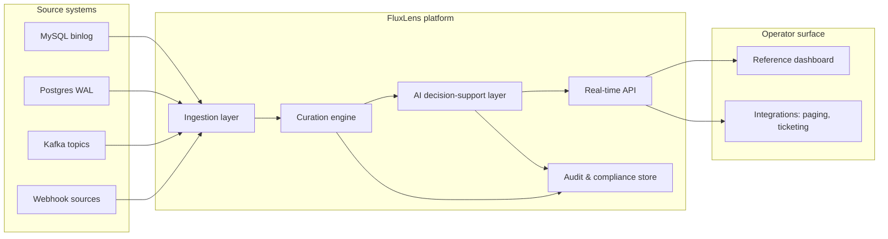
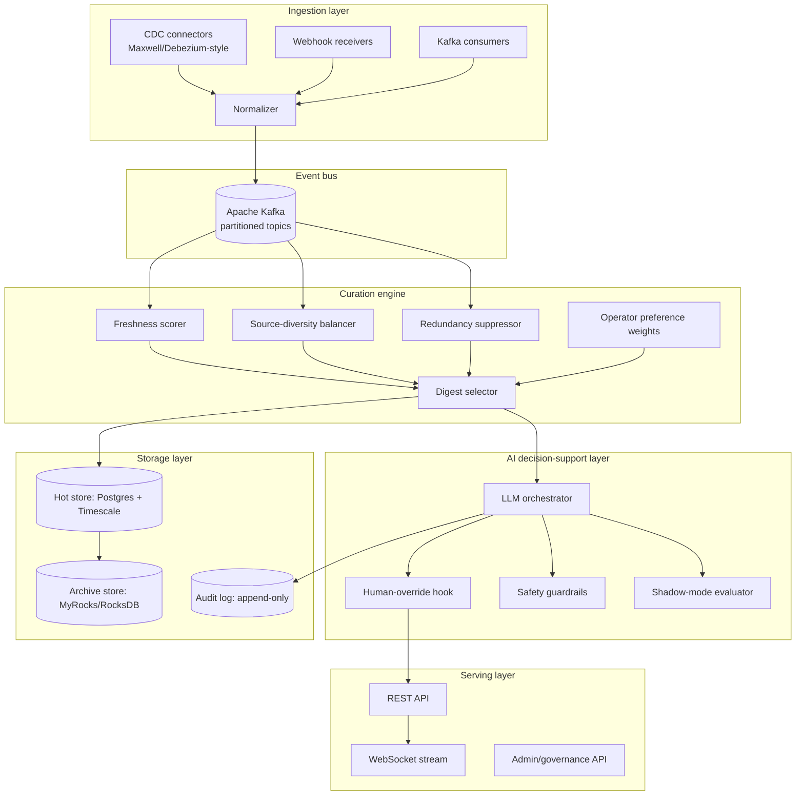
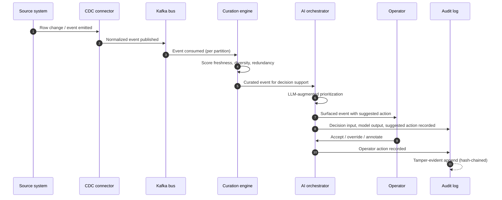
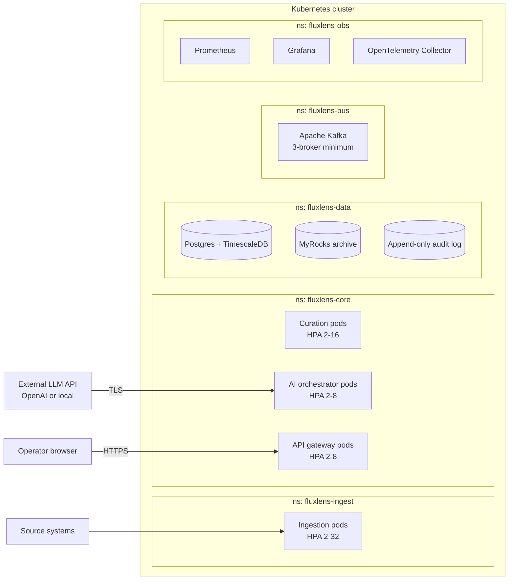
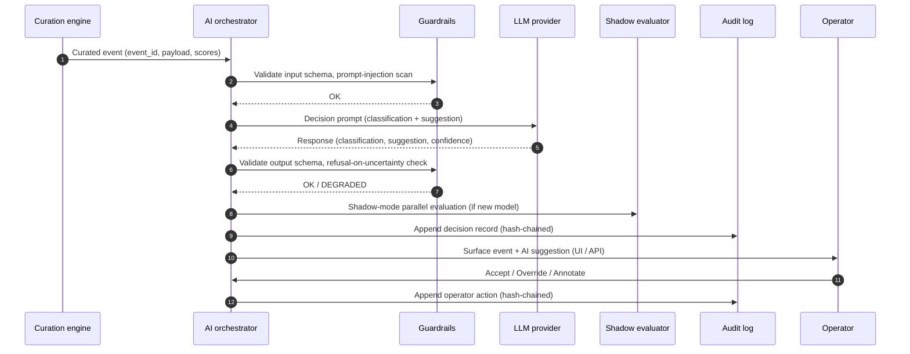

# FluxLens — Product Requirements Document

> **Document status:** Draft v0.1 — May 2026
> **Author:** Sri Harsha Vanga
> **Last updated:** May 16, 2026

## 1. Executive Summary

FluxLens is an open-source platform for AI-augmented industrial event
curation and decision support. It addresses a recurring problem in
U.S.-critical industrial operations — clean-energy manufacturing,
national-scale retail and supply-chain operations, federally funded
research environments — where operators are overwhelmed by
high-velocity event streams and lack tooling that combines
hyper-scale ingestion, intelligent curation, AI-augmented decision
support, and federally compliant auditability.

FluxLens provides a single composable platform that:

1. Ingests events from distributed sources at production scale with
   zero impact on source systems, using Change Data Capture (CDC)
   patterns.
2. Curates the resulting event streams using freshness, source-
   diversity, and redundancy-aware algorithms so that operators see
   the highest-value events without alert fatigue or source
   monopolization.
3. Augments operator decision-making with LLM copilots constrained
   by hard human-override guarantees and per-decision audit trails.
4. Produces a verifiable, immutable audit trail for every decision —
   appropriate for sectors subject to federal compliance requirements.

The project is the open-source counterpart to two prior research
efforts published by the project lead. It is targeted at U.S.
operators in sectors identified by federal policy (Inflation
Reduction Act §45X, CHIPS and Science Act, CISA-designated critical
infrastructure, NIST AI Risk Management Framework) as strategically
important.

## 2. Problem Statement

### 2.1 The signal-overload problem in critical operations

Modern industrial, retail, energy, and federal research operations
generate high-velocity event streams from distributed sources. A
single clean-energy manufacturing line can emit millions of sensor,
telemetry, quality, and supply-chain events per day across thousands
of devices. A national retailer emits similar volumes from store
operations, workforce scheduling, supply-chain telemetry, and
emergency-response systems. A federally funded research environment
emits research-coordination, instrument-telemetry, and security-audit
events from distributed scientific teams.

In each environment, operators face the same composite problem:

1. **Alert fatigue.** Volumes exceed operator attention capacity.
   Important events are missed or acted on late.
2. **Source monopolization.** A small number of high-volume sources
   crowd out lower-volume but operationally critical sources.
3. **Redundancy.** Operators see the same event repeatedly through
   different paths.
4. **Unstructured AI deployment.** Where AI is used to triage events,
   it is often deployed without verifiable human-override guarantees
   or per-decision audit trails — failure modes that
   federally-significant operations cannot tolerate.

### 2.2 Why existing tooling does not solve it

- **Generic CDC platforms (Debezium, Maxwell, Kafka Connect)** solve
  ingestion at scale but do not curate the resulting streams or
  augment them with decision support.
- **Alerting platforms (PagerDuty, Opsgenie)** route events but do
  not curate by freshness/diversity/redundancy or apply AI-augmented
  prioritization.
- **AI assistants (off-the-shelf LLM copilots)** prioritize events
  but lack the verifiable human-override and audit guarantees
  required for federally compliant deployment.
- **Internal one-off solutions** built inside Tesla, Walmart, PNNL,
  and similar operators solve the problem for one organization but
  are not reusable open-source artifacts.

FluxLens is the first open-source platform to combine all four
capabilities — hyper-scale CDC ingestion, freshness/diversity/
redundancy curation, AI-augmented decision support, and federal-
grade auditability — into a single composable reference architecture.

## 3. Target Users

FluxLens is built for engineering teams operating high-velocity
event streams in sectors where decision quality, reliability, and
auditability matter.

| User type | Example | Primary use |
|---|---|---|
| Manufacturing reliability engineer | Clean-energy battery/EV/solar manufacturing | Real-time event curation for production-line alerts |
| Supply-chain operations engineer | National retailer, distribution network | Event-stream prioritization for logistics and frontline operations |
| Federal research IT operations | DOE national laboratory | Research-coordination event surfacing with federal-grade audit |
| Site reliability engineer | Any high-throughput online operator | Cross-source event curation and AI-assisted triage |
| Compliance and audit engineer | Regulated industries | Verifiable per-decision audit trail |

## 4. Goals and Non-Goals

### 4.1 Goals (in scope)

1. Ingest events from common sources (MySQL binlog, PostgreSQL
   logical replication, Kafka topics, generic webhook) with zero
   meaningful impact on source systems.
2. Curate event streams using configurable freshness, source-
   diversity, and redundancy-aware algorithms.
3. Augment operator decisions with LLM copilots that operate under
   hard human-override and audit guarantees.
4. Produce a tamper-evident audit trail for every decision.
5. Deploy on Kubernetes with horizontal scalability.
6. Provide an operator-facing REST and WebSocket API and a reference
   web dashboard.
7. Document architectural patterns sufficient that other engineers
   can adopt or fork the patterns for their own deployments.

### 4.2 Non-Goals (out of scope)

1. Replace specialized industrial control systems (SCADA, MES, OT
   protocols). FluxLens consumes events from these systems but does
   not directly control plant equipment.
2. Replace general-purpose alerting/paging platforms. FluxLens may
   integrate with them downstream.
3. Provide pre-built domain ontologies. Operators define event
   semantics for their own domain.
4. Make autonomous high-stakes decisions without human override.
   Every decision pathway must include a human-override path.

## 5. System Architecture

### 5.1 System context diagram



### 5.2 Component architecture



### 5.3 Data flow diagram



### 5.4 Deployment architecture



## 6. Module Specifications

### 6.1 Ingestion layer

**Purpose.** Consume change events from source systems with zero
meaningful impact on source performance.

**Components.**
- **MySQL CDC connector** — based on the Maxwell pattern documented
  in the project lead's prior paper (Vanga & Buthalapalli, 2025).
  Reads MySQL binlog, emits JSON-formatted change events to Kafka.
- **Postgres CDC connector** — uses logical replication slots and
  `pgoutput` plugin to capture row-level changes.
- **Kafka consumer** — for environments where events are already on
  Kafka; FluxLens re-curates and re-publishes.
- **Webhook receiver** — for generic HTTP event sources.
- **Normalizer** — translates source-specific event shapes into a
  canonical FluxLens event schema (see §10).

**Key reliability properties.**
- At-least-once delivery semantics with idempotent downstream
  consumers.
- Per-partition offset checkpointing.
- Automatic failover via consumer-group rebalancing.
- Dead-letter queue for events that fail normalization after `N`
  retries.

**Throughput target (Phase 1).** Sustained 1,000 events/sec/pod;
horizontally scalable to 32 pods.

### 6.2 Curation engine

**Purpose.** Apply freshness/diversity/redundancy-aware curation to
the ingested event stream, producing a curated digest stream for
downstream decision support.

**Algorithmic basis.** Generalizes the digest-selection algorithms
from Buthalapalli & Vanga (2025), originally developed for social
media digest systems, to industrial event streams. The same
formal objective — maximize freshness, ensure source diversity,
minimize redundancy — applies.

**Six configurable selection strategies** (matching the original
paper's algorithm catalog, adapted to operational events):

1. **Latest events** — pure freshness. Returns the `k` most recent
   events regardless of source.
2. **Latest per source** — pure diversity. Returns the latest event
   per source.
3. **Hybrid latest + per-source** — combines freshness and diversity.
4. **Guaranteed-minimum source diversity** — operator specifies a
   minimum source-coverage percentage; algorithm guarantees it while
   maximizing freshness within the constraint.
5. **Guaranteed minimum with randomized eviction** — variant of (4)
   with randomized eviction policy.
6. **Preferred-source weighting** — operator-specified preferred
   sources are guaranteed representation when present.

**Redundancy suppression.** Hash-based fingerprint of the last `N`
curated events; events whose fingerprints match within the suppression
window are demoted.

**Operator preference weights.** Per-operator (or per-team) weights
on event categories, sources, severity levels.

### 6.3 AI decision-support layer

**Purpose.** Augment operator decision-making on each curated event
with LLM-generated context, classification, suggested action, and
risk assessment — under hard human-override and audit guarantees.

**Architecture properties (non-negotiable).**
- Every decision pathway has a verified human-override hook before
  any external action is taken.
- Every decision (input, model output, suggested action, confidence)
  is written to the audit log before the suggestion is surfaced.
- Shadow-mode evaluator allows new models to run in parallel with
  existing logic without affecting operator surface; predictions
  are logged but not acted on, enabling 60–90 day validation before
  production cutover.
- Safety guardrails: prompt-injection defenses, output schema
  validation, refusal-on-uncertainty.

**LLM integrations supported (Phase 1).**
- OpenAI API (GPT-class models).
- Local model serving (Ollama, vLLM) for environments where
  data-egress is restricted.

**Pluggable model interface.** Operators can substitute their own
models behind a standard interface; FluxLens does not lock to a
specific LLM provider.

### 6.4 Audit and compliance store

**Purpose.** Provide a tamper-evident, append-only record of every
event ingested, every curation decision made, every AI suggestion
generated, and every operator action taken.

**Properties.**
- **Append-only.** No update or delete on audit records.
- **Hash-chained.** Each record contains the hash of the prior record;
  any tampering breaks the chain and is detectable.
- **Schema-validated.** Audit records conform to a versioned schema.
- **Retention-policy aware.** Per-record TTL with partition-level
  drop for efficient purge (pattern from Vanga & Buthalapalli 2025).

**Compliance alignment.**
- Authentication and access control patterns aligned with federal IT
  compliance models (FedRAMP-style separation of duties).
- Audit-log export supports SIEM ingestion (Splunk, Elastic).

### 6.5 Real-time API

**Purpose.** Expose curated event streams, AI suggestions, and
operator actions to dashboards and integrations.

**Endpoints (Phase 1).**
- `GET  /api/v1/health` — health and component status
- `GET  /api/v1/digest/:strategy/:diversity/:n` — request a curated
  digest using one of the six selection strategies
- `WS   /api/v1/stream` — real-time push of curated events
- `POST /api/v1/decisions/:id/override` — operator override
- `GET  /api/v1/audit/:from/:to` — audit log export
- `GET  /api/v1/config/sources` — list configured sources
- `POST /api/v1/config/sources` — register a new source
- `POST /api/v1/config/reload` — hot-reload configuration

### 6.6 Operator dashboard

**Purpose.** Reference web UI for operators consuming the FluxLens
event stream.

**Capabilities (Phase 1).**
- Live curated event feed with strategy selector
- AI suggestion panel per event
- One-click override / accept / annotate
- Filter by source, severity, time window
- Audit log viewer (read-only)
- Operator preference editor

**Stack.** TypeScript + React; deployed as a static asset behind the
API gateway.

## 7. Curation Algorithms

The curation algorithms generalize the framework from Buthalapalli &
Vanga (2025) to industrial event streams. Formal restatement:

Let \( S = \{s_1, s_2, \ldots, s_n\} \) be the set of registered
event sources. Let \( E_i = \{e_{i,1}, e_{i,2}, \ldots\} \) be the
event stream from source \( s_i \), ordered by timestamp. The
curation engine produces a digest \( D \) of size \( k \) optimizing:

\[ D^* = \arg\max_{D} \, \lambda \cdot \text{freshness}(D) + \mu \cdot \text{diversity}(D) - \gamma \cdot \text{redundancy}(D) \]

where:

- \( \text{freshness}(D) = \frac{1}{k} \sum_{e \in D} \left( \max(\text{age}) - \text{age}(e) \right) \)
- \( \text{diversity}(D) = \frac{|\text{unique sources}(D)|}{|S|} \)
- \( \text{redundancy}(D) = \frac{|D \cap \text{recent digests}|}{|D|} \)

The six selection strategies in §6.2 represent different points on
the \( \lambda \), \( \mu \), \( \gamma \) trade-off surface, with
the guaranteed-minimum-diversity variants providing operator-tunable
constraints rather than pure objective optimization.

## 8. AI Integration Architecture (Sequence)



## 9. Compliance and Audit Model

FluxLens is designed to support deployment in operational environments
subject to federal compliance requirements, including but not limited
to:

- **NIST AI Risk Management Framework (NIST AI 100-1)** — the
  human-override, auditability, and schema-validation requirements in
  §6.3 are designed to operationalize NIST AI RMF trustworthiness
  characteristics.
- **NIST SP 800-53** — control families AC (Access Control), AU
  (Audit and Accountability), and SI (System and Information
  Integrity) are addressed by the audit log, role-based access, and
  schema-validation features.
- **SOC 2 Type II** — auditability and access-control requirements.
- **HIPAA / state-equivalent data-handling rules** — addressed via
  encrypted-at-rest storage, role-based access, and configurable PII
  redaction in the audit log.

FluxLens does not provide a compliance certification by itself;
operators remain responsible for end-to-end compliance of their
deployment. FluxLens provides the architectural primitives that make
compliant deployment achievable.

## 10. Data Models

### 10.1 Canonical event schema

```json
{
  "event_id": "ulid-uuid",
  "source_id": "string",
  "source_type": "mysql_cdc | postgres_cdc | kafka | webhook",
  "event_type": "string (domain-defined)",
  "severity": "info | warn | error | critical",
  "timestamp": "RFC 3339",
  "ingested_at": "RFC 3339",
  "payload": { "...": "domain-specific" },
  "metadata": {
    "trace_id": "string",
    "ingestion_pod": "string",
    "schema_version": "semver"
  }
}
```

### 10.2 Decision record schema

```json
{
  "decision_id": "ulid-uuid",
  "event_id": "ulid-uuid",
  "model_provider": "openai | local | shadow",
  "model_id": "string",
  "prompt_hash": "sha-256",
  "response": { "classification": "...", "suggestion": "...", "confidence": 0.87 },
  "guardrails_status": "pass | degraded | rejected",
  "shadow_results": [ "...optional..." ],
  "operator_action": null,
  "audit_chain_prev_hash": "sha-256",
  "audit_chain_hash": "sha-256",
  "timestamp": "RFC 3339"
}
```

## 11. API Design

See §6.5 for endpoint surface. All endpoints:

- Authenticate via OAuth2 (PKCE for browser clients, client-credentials
  for service-to-service)
- Authorize via role-based access (operator / reviewer / admin / auditor)
- Rate-limit per principal
- Emit OpenTelemetry traces for end-to-end observability

OpenAPI 3.1 specification will be maintained in `/api/openapi.yaml`
once Phase 1 implementation begins.

## 12. Quality Requirements

| Property | Target |
|---|---|
| Ingestion throughput (per pod) | ≥1,000 events/sec sustained |
| End-to-end latency (event → curated stream) | ≤1 second p99 |
| End-to-end latency (event → AI suggestion surfaced) | ≤3 seconds p99 |
| API availability target | 99.9% (Phase 1); 99.99% (Phase 2) |
| Audit log durability | RPO = 0 (synchronous replication) |
| Test coverage (unit + integration) | ≥80% lines |
| Container image size | ≤200 MB per service |
| Cold-start latency (per pod) | ≤10 seconds |

## 13. Phased Roadmap

See [ROADMAP.md](./ROADMAP.md) for full detail. Summary:

- **Phase 1 (May–July 2026):** MVP — ingestion + curation + AI
  decision-support stub + audit log + reference dashboard.
- **Phase 2 (Aug–Nov 2026):** Production readiness — hardening,
  HA, observability, comprehensive test coverage, public CI.
- **Phase 3 (Dec 2026 – 2027):** Ecosystem and integrations — Helm
  charts, Terraform modules, SIEM integrations, plugin marketplace.

## 14. Comparison to Existing Systems

| System | Ingestion | Curation | AI w/ override | Federal-grade audit | Open source |
|---|---|---|---|---|---|
| Debezium | Strong | None | None | Partial | Yes |
| Maxwell | Strong (MySQL only) | None | None | Partial | Yes |
| Kafka Connect | Strong | None | None | Partial | Yes |
| PagerDuty | Limited | Routing only | None | None | No |
| Opsgenie | Limited | Routing only | None | None | No |
| Splunk Phantom | Moderate | Policy-based | Limited | Strong | No |
| **FluxLens** | **Strong** | **Strong (6 algorithms)** | **Yes, hard guarantees** | **Yes** | **Yes (Apache 2.0)** |

## 15. Open-Source Governance

- **License:** Apache License 2.0.
- **Code of conduct:** Contributor Covenant v2.1.
- **Contribution model:** Pull-request based; signed-commit policy
  (DCO).
- **Decision-making:** Benevolent maintainer (project lead) until a
  steering committee is formed at Phase 2.
- **Release cadence:** Monthly minor releases after Phase 2 GA.

## 16. Additional Features and Components (Phases 2–3)

Re-analysis of the platform surface, prior research papers, and the
three target application domains identified additional capabilities
that significantly increase FluxLens's value to U.S.-critical
operators. These are scheduled across Phases 2 and 3 of the
[ROADMAP](./ROADMAP.md).

### 16.1 Multi-tenancy and organization isolation

Single FluxLens deployment, multiple tenant organizations. Per-tenant
namespacing across every store (canonical events, decisions, audit
log), per-tenant RBAC, and per-tenant configuration overlays.
Operational pattern: a manufacturing-services company providing
managed FluxLens to multiple manufacturer clients; a federal lab
hosting FluxLens for multiple research programs.

### 16.2 Federation / multi-cluster mode

Geographically distributed FluxLens clusters (per-region, per-site,
per-availability-zone) federated through asynchronous event
replication and global audit-log reconciliation. Use cases:
clean-energy manufacturer with multiple U.S. gigafactories; national
retailer with regional distribution centers; DOE multi-laboratory
research coordination.

### 16.3 Domain pack system

Pluggable operator-defined domain configurations (event ontologies,
severity escalation rules, role definitions, recommended curation
settings) packaged as YAML manifests and shipped under
`pkg/domainpack/`. Reference packs for clean-energy battery
manufacturing, retail-supply-chain resilience, federal research
coordination. Operators may publish private domain packs for
internal use.

### 16.4 Anomaly detection module

Statistical (EWMA, IQR, Mahalanobis) and ML-based (isolation forest,
autoencoder) anomaly detection layered between ingestion and
curation. Anomalous events are flagged with `requires_review` and
prioritized in the curation engine independent of source-defined
severity.

### 16.5 KMS-signed audit log

Phase 2 extension: each audit record is signed with a per-deployment
KMS-backed key in addition to being hash-chained. Supports
deployments requiring strict non-repudiation (e.g., warranty claim
defensibility, regulatory submission, evidentiary use).

### 16.6 Air-gapped deployment mode

Complete operational mode for deployments that cannot make outbound
network calls. Local LLM providers (Ollama, vLLM), mirrored
container registry, local-only telemetry export. Designed for DOE
national-laboratory environments and federally regulated sectors.

### 16.7 Replay system

Replay historical event streams against new model versions, new
curation strategies, or new policy configurations. Enables
backtesting and A/B evaluation of model changes before production
deployment. Backed by the archive tier and surfaced via the admin
API.

### 16.8 Policy engine

Operator-defined policies expressed in Rego (Open Policy Agent)
evaluated by the orchestrator before any AI suggestion is surfaced.
Examples: "do not surface suggestions involving facility X to
operators outside the safety-officer role", "always require
two-operator review for events with severity == critical",
"prohibit autonomous mode under all conditions" (the platform-level
default, expressible as policy for auditor inspection).

### 16.9 Edge ingestion gateway

Lightweight ingestion gateway for OT/manufacturing environments
where the FluxLens cluster sits behind a firewall and on-floor
agents push events outbound. Supports buffered offline operation
during network partition (replays buffered events on reconnect).

### 16.10 Multi-LLM ensemble

Phase 2/3 capability: route a decision through multiple LLM
providers in parallel, evaluate response consistency, surface
divergence to operator review. Defends against single-provider
degradation and supports model-comparison workflows.

### 16.11 PII detection and redaction

Phase 2 module: pluggable PII detector (regex baselines for SSN,
phone, email; ML-based for free-form text) integrated into the
ingestion normalizer and audit-log writer. PII fields are redacted
in the audit log by default with policy-controlled un-redaction for
authorized auditors.

### 16.12 Cost observability (FinOps)

Per-deployment cost telemetry: per-tenant LLM cost attribution,
per-source ingestion cost attribution, per-archive-partition
storage cost. Exported via Prometheus metrics for operator
dashboards.

### 16.13 Model registry integration

Phase 3: integration with standard MLOps model registries (MLflow,
Weights & Biases) for tracking deployed model versions, shadow-mode
evaluation results, and rollback history.

### 16.14 Time-travel queries

Phase 3: query historical operator surface state at any prior
timestamp, supporting "what did the operator see at time T?"
queries for after-action review, regulatory inquiry, and warranty
defense.

### 16.15 Integration plugin catalog

Phase 3: published catalog of integrations (Splunk, Elastic,
PagerDuty, Opsgenie, ServiceNow, Slack, Microsoft Teams, custom
webhooks) packaged as installable plugins with operator-managed
configuration.

## 17. References

1. Vanga, S. H., & Buthalapalli, Y. (2025). *High-Throughput Archival
   and Purge System Using Maxwell CDC: Achieving Trillion-Scale
   Database Management with Zero Production Impact.*
2. Buthalapalli, Y., & Vanga, S. H. (2025). *Balancing Freshness and
   Diversity in Social Media Digest Systems.*
3. National Institute of Standards and Technology, *Artificial
   Intelligence Risk Management Framework (NIST AI 100-1)*, January
   2023.
4. Executive Order 14110, *Safe, Secure, and Trustworthy Development
   and Use of Artificial Intelligence*, 88 Fed. Reg. 75191 (October
   30, 2023).
5. M. Callaghan et al., *MyRocks: A Space- and Write-Optimized MySQL
   Database*, Facebook Engineering Blog, 2016.
6. J. Kreps, N. Narkhede, J. Rao, *Kafka: A Distributed Messaging
   System for Log Processing*, Proceedings of NetDB Workshop, 2011.
7. Inflation Reduction Act of 2022, Pub. L. 117-169.
8. CHIPS and Science Act of 2022, Pub. L. 117-167.
9. Presidential Policy Directive 21, *Critical Infrastructure Security
   and Resilience* (February 12, 2013).
10. Federal Emergency Management Agency, *National Preparedness Goal*,
    Second Edition (September 2015).
11. NIST Special Publication 800-53 Rev. 5, *Security and Privacy
    Controls for Information Systems and Organizations*.
