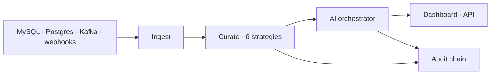

# FluxLens

**Open-source platform for AI-augmented industrial event curation and decision support.**

[](./LICENSE)
[](#what-shipped)
[](https://golang.org)

> **TL;DR.** FluxLens combines change-data-capture ingestion, freshness/diversity/redundancy-aware event curation, AI decision support with **hard human-override guarantees**, and a **tamper-evident audit log**. Built for operational environments where event volume overwhelms operators (manufacturing lines, large retail networks, research IT). Apache 2.0.  
> https://github.com/sriharshav1/fluxlens

---

## The problem

Modern industrial operations run on **events**: line faults, inventory deltas, compliance signals, security anomalies, supplier delays. At gigafactory, retail, and research scale, those events arrive **faster than any team can read them**.

That gap is not a tooling inconvenience. It is where **outages start**, **quality escapes**, and **incidents turn into crises** because the right signal was buried under noise.

Every serious operator hits the same wall:

- **Volume beats attention.** Dashboards and paging multiply; operators still miss what matters because the firehose never stops.
- **Loud sources win.** One chatty system dominates the feed while a quiet line, cold chain, or security edge case goes unseen until it is expensive.
- **Raw AI is not deployable.** A model that can summarize an alert cannot, by itself, satisfy regulated environments. You need suggestions operators can **reject**, with proof of who decided what.
- **After the fact, you need evidence.** Regulators, insurers, and your own postmortems ask the same question: what did the system recommend, what did a human do, and can you prove the record was not altered?

Generic observability stacks **store** events. Generic LLM wrappers **chat about** them. Neither was built for the full loop industrial teams need: **ingest at source fidelity, curate for operator attention, assist under guardrails, audit every step**.

The complete pattern (CDC-scale ingestion, diversity-aware curation, guarded decision support, hash-chained audit) has never been available as a **coherent, open platform** you can adopt, inspect, and extend.

**FluxLens closes that gap.** It is the reference implementation of that loop, designed so operational software keeps pace with the systems it is meant to protect.

## What FluxLens is

A composable stack with four layers:

### 1. Ingestion

Read changes from source systems with minimal impact on the sources:

- **MySQL** binlog CDC (`fluxlens-ingest-mysql`)
- **Postgres** logical replication (`fluxlens-ingest-postgres`)
- **Kafka** topics (curator/orchestrator pipeline)
- **HTTP webhooks** (`POST /api/v1/webhook` or `fluxlens-webhook-gateway`)
- **Synthetic** traffic for demos (`fluxlens-synth-source`)

Everything normalizes to one **canonical event** schema before curation.

### 2. Curation

Six configurable algorithms balance three tradeoffs operators actually care about:

- **Freshness** (see the latest)
- **Diversity** (no single source monopolizes the digest)
- **Redundancy suppression** (do not show the same event ten times)

The dashboard exposes strategy, diversity %, and digest size (`k`). The same parameters drive `fluxlens-curator` in the Kafka pipeline.

### 3. AI decision support (with hard guarantees)

The orchestrator calls an LLM through a pluggable provider (OpenAI-compatible, Ollama, vLLM, or mock for CI), validates input and output with **guardrails**, and returns a **suggestion to the operator**. It never takes a consequential action itself. Accept, override, and annotate are recorded in the audit chain. **Override is enforced in code**, not in policy.

On critical/error events the dashboard offers **Suggested actions**: similar past resolutions from the audit chain inform the model; the operator still chooses the outcome.

### 4. Tamper-evident audit

Every ingest, digest selection, model output, and operator action is **hash-chained**. Tampering breaks the chain detectably. Optional **Postgres** persistence (`FLUXLENS_POSTGRES_DSN`) plus `fluxlens-chain-verifier` support durable deployments.



## What shipped

A working **Phase 1 MVP** you can run on a laptop:

- **Operator dashboard** (React): live digest, scores, audit viewer, alerts, suggested actions, pipeline decisions when Kafka is connected
- **API gateway**: REST, WebSocket (`/api/v1/stream`), webhooks, OpenAPI, Prometheus metrics, API-key RBAC
- **Kafka pipeline**: synth → curator → orchestrator → decisions topic; gateway can bridge decisions into the UI
- **Connectors**: MySQL binlog CDC, Postgres logical replication, webhook gateway
- **Tests** for all six curation strategies, audit chain verification, orchestrator guardrails
- **Domain packs** (clean energy, retail, federal research), ADRs, compliance mapping docs, Helm chart skeleton, `docker-compose` dev stack

## What is not claimed yet

- Production-ready for multi-AZ, regulated production without your own hardening pass
- OAuth2/OIDC (API-key roles ship today; full OIDC is Phase 2)
- Hosted SaaS or closed-source extensions (the repo stays Apache 2.0)
- Customer case studies (none yet; feedback welcome)

Details and dates: [`ROADMAP.md`](./ROADMAP.md).

## Try it

**You need:** Go 1.22+, Node 20+. Docker only for the full Kafka stack.

### A. See the UI in ~2 minutes (no Docker)

```bash
git clone https://github.com/sriharshav1/fluxlens.git
cd fluxlens
make build

./bin/fluxlens-api-gateway --addr :8090 &
./bin/fluxlens-synth-source --no-kafka --gateway http://localhost:8090 --rate 25 --source-count 12 &
cd dashboard && npm install && npm run dev
```

Open **http://localhost:5173**. You should see events flowing, freshness/diversity/redundancy scores, audit chain status, and suggested actions on critical rows.

### B. Full pipeline (Kafka + curation + LLM + live decisions)

Terminal 1:

```bash
make dev    # Kafka, Postgres, mock LLM, Prometheus, Grafana
```

Terminals 2–5:

```bash
make build

./bin/fluxlens-api-gateway --addr :8090 -kafka localhost:9092
./bin/fluxlens-curator --kafka localhost:9092 --strategy 4 --diversity 80 --k 20
./bin/fluxlens-orchestrator --kafka localhost:9092 --llm-base http://localhost:8080
./bin/fluxlens-synth-source --kafka localhost:9092 --rate 100 --source-count 20 \
  --gateway http://localhost:8090
```

Terminal 6: `cd dashboard && npm run dev`

The **Pipeline decisions** panel and WebSocket feed light up when orchestrator output reaches the gateway.

`make demo` only starts Docker and synthetic Kafka load; you still run gateway/curator/orchestrator for the full UI path.

### C. Smoke-test the API

```bash
curl -s localhost:8090/api/v1/health | jq
curl -s "localhost:8090/api/v1/digest?strategy=4&diversity=80&k=10" | jq
curl -s localhost:8090/api/v1/audit | jq '.verified, (.records | length)'
```

## Documentation

| Doc | For |
|-----|-----|
| [`PRD.md`](./PRD.md) | Requirements, operator flows, API contract |
| [`ARCHITECTURE.md`](./ARCHITECTURE.md) | Services, diagrams, wedge vs Kafka paths |
| [`ROADMAP.md`](./ROADMAP.md) | Phase 2/3 milestones |
| [`CONTRIBUTING.md`](./CONTRIBUTING.md) | Dev setup and PRs |
| [`docs/adr/`](./docs/adr/) | Design decisions |

## Get involved

- **Try the demo** and [open an issue](https://github.com/sriharshav1/fluxlens/issues) with what confused you or what you need.
- **Contribute** connectors, domain packs, tests, or docs.
- **Discuss** on [GitHub Discussions](https://github.com/sriharshav1/fluxlens/discussions).

## License

Apache License 2.0. See [`LICENSE`](./LICENSE).

## Citation

```bibtex
@misc{fluxlens2025,
  author       = {Vanga, Sri Harsha},
  title        = {FluxLens: An Open-Source Platform for AI-Augmented
                  Industrial Event Curation and Decision Support},
  year         = {2025},
  howpublished = {GitHub repository},
  url          = {https://github.com/sriharshav1/fluxlens}
}
```
