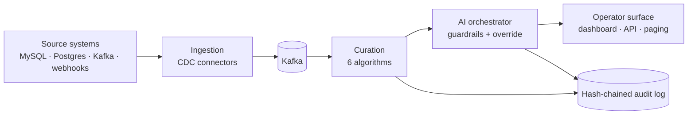

# FluxLens

> **Open-source platform for AI-augmented industrial event curation and
> decision support.**
>
> Hyper-scale ingestion. Freshness/diversity/redundancy-aware curation.
> AI decision support with hard human-override guarantees.
> Tamper-evident audit logging. For clean-energy manufacturing,
> national-scale retail and supply-chain operations, and federally
> funded research environments.

[](./LICENSE)
[](#status)
[](https://golang.org)
[](./CODE_OF_CONDUCT.md)

---

## What it does



- **Ingest** change events from real source systems with zero impact
  on the source. The CDC pattern at the heart of FluxLens has been
  deployed in production at trillion-records-per-month scale (see
  reference paper below).
- **Curate** the resulting stream so operators see what matters.
  Six selection strategies, each tunable, generalizing the
  freshness/diversity/redundancy framework from a published research
  paper.
- **Augment** operator decisions with LLM-generated context,
  classification, and suggested action — under hard human-override
  and audit guarantees enforced *in code*, not in policy.
- **Audit** every decision and operator action in a tamper-evident,
  hash-chained, append-only log. Optional WORM mirroring for
  high-stakes deployments.

## Quickstart (5 minutes)

```bash
git clone https://github.com/sriharshav1/fluxlens.git
cd fluxlens
make tidy && make test     # build and run all tests
make dev                   # start kafka + postgres + redis + mock LLM + prometheus + grafana
make build                 # compile FluxLens binaries

# In three terminals:
./bin/fluxlens-curator --kafka localhost:9092 --strategy 4 --diversity 80
./bin/fluxlens-orchestrator --kafka localhost:9092 --llm-base http://localhost:8080
./bin/fluxlens-api-gateway --addr :8090

# In a fourth (add --gateway so the dashboard receives the same stream):
./bin/fluxlens-synth-source --kafka localhost:9092 --rate 100 --source-count 20 \
  --gateway http://localhost:8090

# Open the dashboard:
cd dashboard && npm install && npm run dev
# → http://localhost:5173
```

### Demo UI without Docker (screen recordings)

Go + Node.js only — API gateway + synthetic events — no Kafka stack:

```bash
make build

./bin/fluxlens-api-gateway --addr :8090 &
./bin/fluxlens-synth-source --no-kafka --gateway http://localhost:8090 --rate 25 --source-count 12 &
cd dashboard && npm install && npm run dev
# → http://localhost:5173
```

Full quickstart (Kafka + curator + orchestrator): [`docs/tutorials/01-quickstart.md`](./docs/tutorials/01-quickstart.md).

## Why this matters

The U.S. is investing hundreds of billions of dollars in clean-energy
manufacturing capacity (Inflation Reduction Act §45X), advanced
manufacturing R&D (CHIPS and Science Act), and AI deployment that
protects the American workforce (Executive Order 14110, NIST AI Risk
Management Framework). Capital creates capacity; **operational
software determines whether capacity becomes output**.

The operational patterns that work — hyper-scale CDC, intelligent
event curation, AI with verifiable human override, federal-grade
audit — exist privately at large operators. FluxLens makes them
available as open source.

- [`docs/national-interest/`](./docs/national-interest/) — alignment
  with IRA, CHIPS, DOE, CISA critical infrastructure, FEMA, EO 14110
- [`docs/compliance/`](./docs/compliance/) — NIST AI RMF, NIST SP
  800-53 control mappings, FedRAMP readiness posture
- [`docs/domain-packs/`](./docs/domain-packs/) — reference packs for
  clean-energy battery manufacturing, retail supply-chain resilience,
  and federal research coordination

## Architecture

- [`PRD.md`](./PRD.md) — full product requirements with diagrams
- [`ARCHITECTURE.md`](./ARCHITECTURE.md) — system architecture and
  10 mermaid diagrams
- [`ROADMAP.md`](./ROADMAP.md) — three-phase delivery plan
- [`docs/adr/`](./docs/adr/) — ten Architecture Decision Records

## Status

**Phase 1 MVP — early active development. Initial public commit: May 2026.**

- ✅ Canonical event schema
- ✅ All six curation algorithms with unit + end-to-end tests
- ✅ Hash-chained audit log with tamper-detection tests
- ✅ AI orchestrator with guardrails and provider abstraction
- ✅ Mock + OpenAI-compatible LLM providers
- ✅ Synthetic event generator
- ✅ REST API gateway
- ✅ React + TypeScript operator dashboard
- ✅ docker-compose stack for local dev
- ✅ Helm chart skeleton for Kubernetes deployment
- ✅ Full documentation and compliance mapping
- ⏳ MySQL CDC connector (skeleton; full binlog reader Phase 1 M1.3)
- ⏳ Postgres CDC connector (Phase 2 M2.1)
- ⏳ Production-ready Postgres-backed audit chain (Phase 2)
- ⏳ Multi-AZ deployment with chaos testing (Phase 2 M2.6)
- ⏳ OAuth2/OIDC + RBAC (Phase 2 M2.8)

This is real software. It is not yet production-ready software. See
[`ROADMAP.md`](./ROADMAP.md) for the plan to v1.0.0.

## Get involved

| | |
|---|---|
| 🪧 **Use it** | `make demo` and tell us what surprised you |
| 🐛 **Report issues** | https://github.com/sriharshav1/fluxlens/issues |
| ✍️ **Contribute** | See [`CONTRIBUTING.md`](./CONTRIBUTING.md). PRs welcome on docs, code, tests, domain packs |
| 🔒 **Security** | See [`SECURITY.md`](./SECURITY.md) |
| 💬 **Talk** | sriharshav1@gmail.com / linkedin.com/in/sriharshav1 |

## Research provenance

FluxLens synthesizes architectural patterns from two published
technical papers by the project lead:

> Vanga, S. H. & Buthalapalli, Y. (2025). *High-Throughput Archival
> and Purge System Using Maxwell CDC: Achieving Trillion-Scale
> Database Management with Zero Production Impact.* The ingestion
> and archive architecture of FluxLens extends the CDC + Kafka +
> LSM-tree pattern documented here.

> Buthalapalli, Y. & Vanga, S. H. (2025). *Balancing Freshness and
> Diversity in Social Media Digest Systems.* The curation
> algorithms in FluxLens generalize the freshness/diversity/
> redundancy framework from this paper, applied to industrial
> event streams.

## License

Apache License 2.0 — see [`LICENSE`](./LICENSE).

## Citation

```bibtex
@misc{fluxlens2026,
  author       = {Vanga, Sri Harsha},
  title        = {FluxLens: An Open-Source Platform for AI-Augmented
                  Industrial Event Curation and Decision Support},
  year         = {2026},
  howpublished = {GitHub repository},
  url          = {https://github.com/sriharshav1/fluxlens}
}
```
